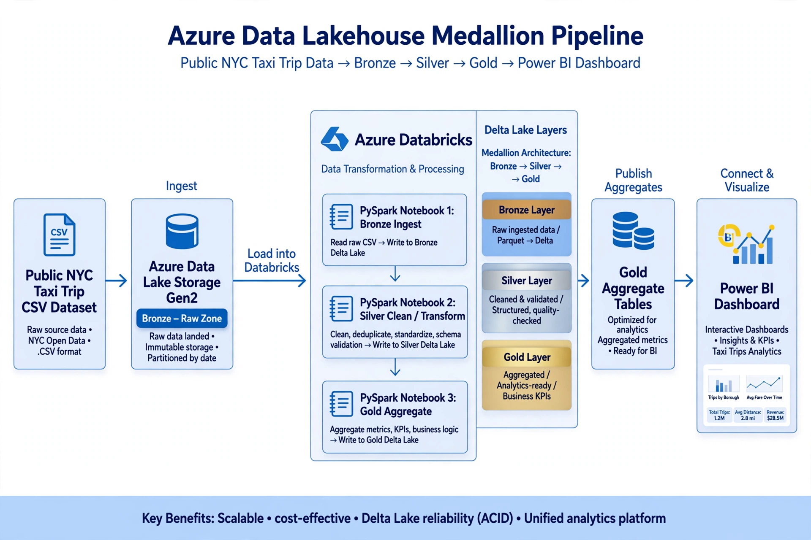
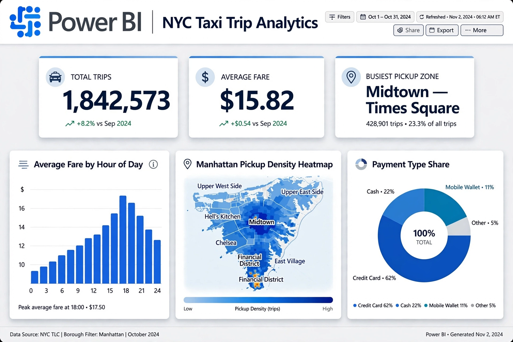

# Azure Databricks Lakehouse — NYC Taxi Analytics Pipeline

An end-to-end **data lakehouse** on Azure: raw NYC yellow-taxi trip records land in
**ADLS Gen2**, flow through **Bronze → Silver → Gold** Delta Lake tables built with
**PySpark** in **Azure Databricks**, and surface in an interactive **Power BI**
dashboard.

> **Academic project.** Built on a student Azure subscription as a master's-level
> data-engineering project. It is honestly scoped — one dataset, a single-node
> cluster — and does not pretend to be an enterprise production system.



## Architecture

| Component | Role |
|---|---|
| ADLS Gen2 | Storage layer. Three containers (`bronze`, `silver`, `gold`) hold the Delta tables — cheap, scalable object storage. |
| Azure Databricks | Compute + workspace. Three notebooks run on a small single-node cluster; all PySpark executes here. |
| PySpark | Processing language for reading, cleaning, and aggregating millions of rows without loading them into memory. |
| Delta Lake | Table format on top of ADLS. Adds ACID transactions, schema enforcement, and time travel — the reliability plain Parquet/CSV can't guarantee. |
| Power BI | Reporting layer, connected to the Gold tables via the Databricks SQL connector. |

**Data flow.** Bronze lands raw CSVs exactly as downloaded (plus an ingestion timestamp) —
a permanent, replayable copy of the source. Silver reads Bronze, applies cleaning rules
and fail-loud data-quality checks, and writes one clean Delta table. Gold aggregates
Silver into small business-ready tables the dashboard queries directly.



## Azure setup

1. **Resource group** (e.g. `rg-lakehouse`) in a nearby region.
2. **Storage account** with **hierarchical namespace enabled** (this is what makes it
   ADLS Gen2); locally-redundant storage (LRS) keeps cost near zero.
3. Three containers: `bronze`, `silver`, `gold`.
4. Grant Databricks access with an **access connector for Azure Databricks** holding the
   **Storage Blob Data Contributor** role on the storage account (key-free auth).
5. **Azure Databricks workspace** in the same resource group/region; a small single-node
   cluster (e.g. DS3-class, auto-terminate after 30 minutes).
6. Download one or two months of yellow-taxi data from the NYC TLC trip records page
   and upload the files to `abfss://bronze@<storage-account>.dfs.core.windows.net/raw/`,
   keeping original filenames (e.g. `yellow_tripdata_2024-01.csv`).

## The pipeline

Notebooks run in order: `01` → `02` → `03`. Each takes a `storage_account` widget
parameter. Shared transformation logic lives in `src/transforms.py` so the notebooks
and the local test runner execute identical code.

### 01 — Bronze ingestion (`notebooks/01_bronze_ingestion.py`)
Read the raw CSVs, stamp `ingested_at` + `source_file` provenance columns, append to
the `trips_delta` Delta table. No cleaning — Bronze stays a faithful copy of the source.

### 02 — Silver cleaning & validation (`notebooks/02_silver_cleaning.py`)
Cleaning rules (each exists because the real TLC data contains that defect):
- drop-off must not precede pickup (timestamp ordering)
- `trip_distance`, `fare_amount`, `passenger_count` must be positive
- key columns (`pickup_ts`, `dropoff_ts`, `PULocationID`, `fare_amount`) must not be null
- exact duplicates removed on a natural key
- derived columns: `pickup_hour`, `trip_minutes`

Data-quality checks **fail loudly** — row counts plus null/timestamp/range validations
raise `AssertionError` instead of silently shipping bad data. Silver is fully rebuilt
from Bronze each run (`overwrite` is safe).

### 03 — Gold aggregates (`notebooks/03_gold_aggregates.py`)
- `fare_by_hour` — average fare and trip count per pickup hour (morning/evening peaks)
- `busiest_zones` — top 20 pickup zones by trip volume, with average fare
- `tip_by_payment` — average tip percentage by payment type (card vs cash behaviour)

### Power BI
Connect Power BI to the Gold tables through the **Databricks SQL connector** (or views
over them). The dashboard is deliberately small — KPI cards, a fare-by-hour line chart,
a busiest-zones bar chart, and a tip-behaviour column chart. Pointing Power BI at Gold
instead of Silver means every refresh queries tiny pre-computed tables rather than
re-scanning millions of rows.

## Repo structure

```
nyc-taxi-lakehouse/
├── notebooks/
│   ├── 01_bronze_ingestion.py   # Databricks notebook (source format)
│   ├── 02_silver_cleaning.py    # Databricks notebook (source format)
│   └── 03_gold_aggregates.py    # Databricks notebook (source format)
├── src/
│   └── transforms.py            # Shared PySpark logic (cleaning, DQ, aggregates)
├── local/
│   ├── generate_sample.py       # Sample CSV generator with realistic defects (stdlib only)
│   └── run_local.py             # Local Spark run of the full pipeline (Parquet, no Azure)
├── docs/images/                 # Architecture diagram + dashboard mockup
├── requirements.txt
└── .gitignore
```

## Run it

**On Databricks:** check the repo out via Databricks Repos, update the `sys.path` line in
notebooks `02`/`03` to point at `src/`, set the `storage_account` widget, and run the
notebooks in order.

**Locally (no Azure):**
```bash
pip install -r requirements.txt
python local/generate_sample.py   # creates local/data/yellow_sample.csv
python local/run_local.py         # runs Bronze→Silver→Gold with local Spark
```
The local run validates the exact same transformation code against sample data with
injected defects (nulls, bad timestamps, negative fares, duplicates) and writes the
tables to `local/output/`.

## Possible extensions
- Join the TLC zone lookup table so the dashboard shows zone names, not IDs
- Partition Silver by pickup date for faster incremental loads
- Incremental ingestion with Auto Loader + Delta `MERGE` instead of full rebuilds
- A DQ results table so each run's checks become queryable history
